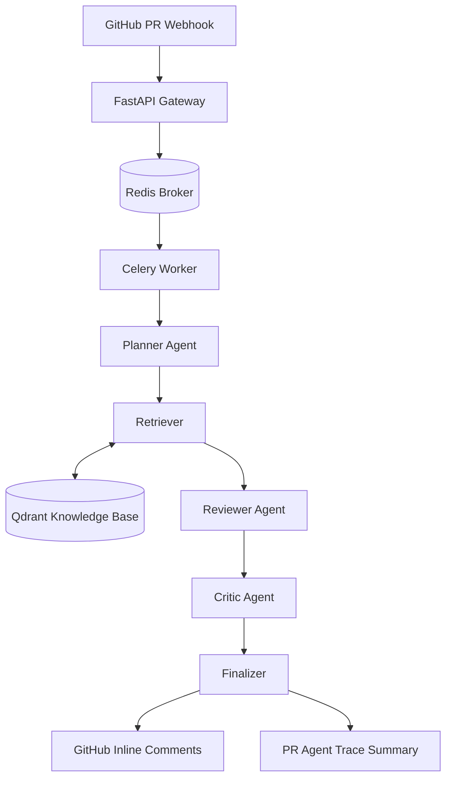

# Agentic RAG Code Reviewer

一个面向 GitHub Pull Request 的多 Agent 代码审查原型系统。项目基于 FastAPI、Celery、Redis、Qdrant 和 LangGraph，将 PR Webhook 接入、异步任务处理、RAG 规范检索、风险分级、候选审查意见生成、Critic 过滤和审查轨迹展示串成完整流程。

相比简单的 "把 diff 扔给 LLM" 的代码审查工具，本项目重点展示一个可解释的多 Agent 工作流：

```text
GitHub Webhook
  -> Celery Review Job
  -> Planner
  -> Retriever
  -> Reviewer
  -> Critic
  -> Finalizer
  -> GitHub Inline Comments + PR Trace Summary
```

## Features

- **异步 PR 审查流水线**：FastAPI 接收 GitHub Webhook 后将任务交给 Celery Worker，避免在 Webhook 请求中执行重型 LLM/RAG 逻辑。
- **Planner Agent 风险分级**：根据用户声明的 Tier 和 diff 内容推断最终审查等级。系统尊重用户设置，但当代码涉及鉴权、支付、SQL、运行时改源码等高风险场景时会自动升档。
- **Tier Resolver 策略**：最终等级采用 `max(user_requested_tier, system_inferred_tier)`，只允许系统升档，不自动降档，避免忽略 PR 作者的业务上下文。
- **RAG 规范检索**：使用 Qdrant 存储团队代码规范、历史误报修正规则和上下文补丁，并结合本地 HuggingFace embedding 进行检索。
- **Reviewer Agent 候选意见生成**：结合 diff、完整文件上下文、检索到的规范和静态检查结果，生成结构化候选 finding。
- **Critic Agent 误报过滤**：对候选意见进行二次校验，过滤缺少证据、行号不可靠、主观风格偏好或重复的评论。
- **Agent Trace 可观测性**：每个文件的 Planner、Retriever、Reviewer、Critic 结果会被格式化为 PR 级别 trace，方便调试和展示系统决策路径。
- **Human-in-the-loop 反馈入口**：支持通过 PR 评论触发普通对话或误报反馈流程，将有效误报原因沉淀为后续检索记忆。

## Architecture

系统由四类主要组件组成：

1. **Gateway API**
   FastAPI 负责接收 GitHub Webhook、校验签名、解析事件和 PR metadata，并将 review 任务交给 Celery。

2. **Async Worker**
   Celery Worker 负责拉取 PR 文件、调用多 Agent 审查流程、提交 inline review，并发布 PR 级别 summary。

3. **Agentic Review Pipeline**
   LangGraph 编排 `planner -> retrieve -> reviewer -> critic -> finalize`。节点之间通过结构化 state 传递计划、规范、候选意见、最终意见和 trace。

4. **Memory / Knowledge Base**
   Qdrant 存储代码规范和误报修正规则。本地 embedding 模型用于将 diff 意图和规范文本映射到同一语义空间。



## Multi-Agent Workflow

### 1. Planner

Planner 读取 PR metadata、diff 内容和文件信息，输出结构化计划：

```json
{
  "user_requested_tier": "Tier-A",
  "system_inferred_tier": "Tier-S",
  "final_tier": "Tier-S",
  "risk_reasons": ["Detected payment or SQL mutation logic"],
  "selected_checks": ["security", "idempotency", "api_resilience"]
}
```

核心策略：

- 用户请求高 Tier 时，系统不会自动降档。
- 系统识别到更高风险时会自动升档。
- `final_tier` 会影响后续是否启用深度语义检查、AST 全局影响分析和更严格的 Critic 过滤。

### 2. Retriever

Retriever 根据文件语言、风险计划和 diff 意图检索相关规范，并返回：

- 匹配到的团队规范
- 历史误报补丁
- 需要禁用或弱化的检查项

### 3. Reviewer

Reviewer 生成结构化候选 finding，而不是直接输出 GitHub 评论：

```json
{
  "file": "test_scenarios/test_tier_upgrade.py",
  "line": 12,
  "comment": "直接使用 f-string 拼接 user_id 和 amount 构造 SQL，存在 SQL 注入风险，应改为参数化查询。",
  "check": "security",
  "evidence": "UPDATE user_wallets SET balance = balance - {amount} WHERE user_id = {user_id}",
  "severity": "error"
}
```

### 4. Critic

Critic 对候选 finding 做二次验证：

- 行号是否出现在新文件侧 diff 中
- 文件是否属于当前 PR
- finding 是否有具体 evidence
- 是否只是主观风格建议
- 是否与检索到的规范或 selected check 有关
- 是否与其他 finding 重复

Critic 会输出保留和丢弃的结果，并将丢弃原因写入 Agent Trace。

### 5. Finalizer

Finalizer 将保留的 finding 转换为 GitHub inline review comment，同时生成 PR 级别的 trace summary。

## Example PR Behavior

一个测试 PR 中包含三个文件：

- `test_rule_allowance.py`：业务允许的特殊规则场景
- `test_rule_violation.py`：运行时读取并覆盖源码文件
- `test_tier_upgrade.py`：支付扣款逻辑中存在 SQL 拼接和事务风险

系统表现：

- 对普通允许场景保持较低风险等级。
- 对运行时修改源码的场景升档到 `Tier-S`。
- 对支付/SQL 场景升档到 `Tier-S`。
- Reviewer 生成候选意见后，Critic 会丢弃证据不足或偏主观的评论。
- PR 页面会同时包含 inline comments 和一条 Agent Trace summary。

## API And Interaction

### GitHub Webhook

```text
POST /webhook/github
```

处理 GitHub `pull_request`、`issue_comment` 和 `pull_request_review_comment` 事件。

### Knowledge Ingestion

```text
POST /knowledge/ingest
```

将团队规范或特殊业务规则写入 Qdrant。

### PR Metadata

开发者可以在 PR 描述中声明审查等级：

```text
>>>Tier-A<<<
```

也可以使用更完整的 metadata：

```text
>>>REVIEW_METADATA<<<
Tier: Tier-A
Context: Payment callback refactor.
Focus: SQL injection, transaction consistency, idempotency.
>>>END<<<
```

## Quick Start

### 1. Prepare Environment

创建 `.env` 文件：

```env
GITHUB_TOKEN=your_github_token
GITHUB_WEBHOOK_SECRET=your_webhook_secret

DEEPSEEK_API_KEY=your_deepseek_key
DEEPSEEK_BASE_URL=https://api.deepseek.com/v1

QDRANT_URL=http://qdrant:6333
CELERY_BROKER_URL=redis://redis:6379/0
CELERY_RESULT_BACKEND=redis://redis:6379/0
```

不要将真实 `.env` 提交到仓库。建议额外维护 `.env.example`。

### 2. Start Services

```bash
docker-compose up -d --build
```

### 3. Check Logs

```bash
docker logs code_reviewer_api -f
docker logs code_reviewer_worker -f
```

## Project Structure

```text
app/
  api/routes/
    webhook.py       # GitHub webhook entry
    knowledge.py     # Knowledge ingestion API
  core/
    config.py        # Environment settings
    llm.py           # LLM client initialization
  services/
    github.py        # GitHub API integration
    rag.py           # LangGraph multi-agent review pipeline
  skills/
    ast_tools.py
    hardcoded_secrets_check.py
    idempotency_check.py
    api_resilience_check.py
    print_statement_check.py
    type_hints_check.py
worker.py            # Celery app and task definitions
docker-compose.yml   # API, Worker, Redis, Qdrant
```

## Current Limitations

这个项目仍是原型系统，当前重点是展示多 Agent 审查链路和可解释流程，而不是完整生产级代码审查平台。

已知改进方向：

- 进一步降低噪音：合并同函数、同根因、相邻行号的重复评论。
- Global Impact 节点改为结构化输出，仅在 `has_warning=true` 时发布 warning。
- Critic 的 dropped reason 需要进一步产品化，避免暴露模型推理式表达。
- 增加 pytest 覆盖 Tier Resolver、Critic 过滤、diff 行号映射和 RAG metadata 读写。
- 为 Celery 增加 retry、任务幂等 key、超时控制和失败告警。
- 增加 CI，覆盖 lint、type check、unit tests 和 Docker build。

## Resume-Friendly Summary

基于 FastAPI、Celery、Redis、Qdrant 和 LangGraph 独立实现 GitHub PR 多 Agent 自动审查原型。系统通过 Planner Agent 结合用户声明和 diff 风险自动解析最终审查等级，通过 RAG Retriever 注入团队规范，通过 Reviewer Agent 生成结构化候选意见，并由 Critic Agent 过滤误报和低证据评论，最终以 GitHub inline comment 和 Agent Trace 的形式输出可解释审查结果。

