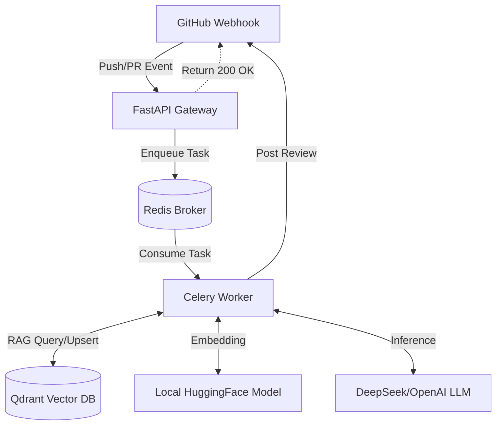

# 🤖 Agentic RAG Code Reviewer


An **Enterprise-Grade, Agentic RAG-powered Code Review System**. This project leverages Large Language Models (LLMs) and Vector Databases to automatically review GitHub Pull Requests, provide context-aware suggestions, and maintain a self-evolving knowledge base of corporate coding guidelines.

## ✨ Core Features & Architecture Highlights

- ⚡ **Zero-Drop Asynchronous Queue**: Built on **Celery + Redis**, completely decoupling the GitHub Webhook (FastAPI) from heavy LLM inference. Eliminates GitHub's 10-second timeout constraints and ensures tasks survive container restarts (Robust Chaos Engineering).
- 🧠 **Context-Aware RAG Engine**: Integrates **Qdrant** vector database to store and retrieve historical PR reviews, architectural guidelines, and team rules. The AI "remembers" past mistakes.
- 🐳 **One-Click Containerization**: Fully orchestrated via `docker-compose`. Includes Web API, Celery Worker, Redis Message Broker, and Qdrant DB.
- 🔒 **Privacy & Offline Support**: Uses local HuggingFace Embedding models (`BAAI/bge-small-zh-v1.5`) with physical cache mounting (`HF_HUB_OFFLINE=1`). Embeddings are calculated strictly on-premise without network tracking.
- 🚦 **Multi-Tier Routing**: Implements dynamic task routing based on PR complexity (Tier-S, Tier-A, Tier-B), intelligently allocating computational resources.

---

## 🏗️ System Architecture

The system consists of 4 isolated Docker containers communicating via a dedicated Docker network:

1. **Gateway Node (FastAPI)**: Lightweight webhook listener. Validates GitHub HMAC signatures, parses PR payloads, and enqueues tasks.
2. **Message Broker (Redis)**: High-performance memory buffer. Absorbs traffic spikes and guarantees task delivery.
3. **Compute Node (Celery Worker)**: The heavy lifter. Downloads diffs, queries the vector database, prompts the LLM, and posts review comments back to GitHub.
4. **Memory Node (Qdrant)**: Persistent vector storage for corporate knowledge and developer guidelines.



---

## 🚀 Quick Start

### 1. Prerequisites
- Docker & Docker Compose
- A GitHub repository with Webhooks enabled
- DeepSeek / OpenAI API Key

### 2. Environment Setup
Create a `.env` file in the root directory:
```env
# GitHub Auth
GITHUB_TOKEN=ghp_your_classic_repo_token_here
GITHUB_WEBHOOK_SECRET=your_secret_string

# LLM Configuration
DEEPSEEK_API_KEY=sk-your_api_key
DEEPSEEK_BASE_URL=https://api.deepseek.com/v1

# Component URLs (Internal Docker Network)
QDRANT_URL=http://qdrant:6333
REDIS_URL=redis://redis:6379/0
```

### 3. Deploy Infrastructure
Run the following command to build the images and start the distributed system:
```bash
docker-compose up -d --build
```

### 4. Verify Services
You can verify the robust architecture by inspecting the container logs:
```bash
# Watch the Gateway receive instant webhooks
docker logs code_reviewer_api -f

# Watch the Worker execute AI inference asynchronously
docker logs code_reviewer_worker -f
```

---

## 🔧 Technical Implementations (For Interviewers)

- **Proxy & TLS MITM Resilience**: Configured `httpx.AsyncClient(verify=False)` and `HF_HUB_OFFLINE=1` to ensure the system survives enterprise VPN environments and TLS interception without crashing.
- **Cache Persistence**: Deep learning model weights (`bge-small-zh`) are mounted natively from the host to the container via `volumes`, reducing initialization time from minutes to milliseconds.
- **Graceful Error Handling**: Implemented multi-layered exception mapping for `httpx.ConnectError` and GitHub API rate-limiting, ensuring the background worker gracefully retries failed submissions.

---
*Built with ❤️ for next-generation developer productivity.*
